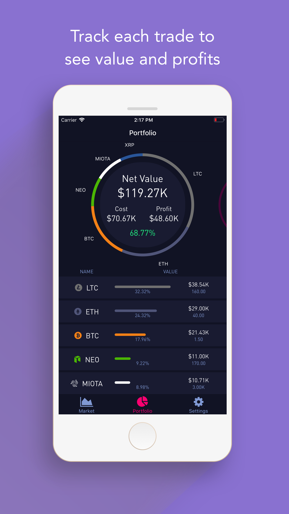
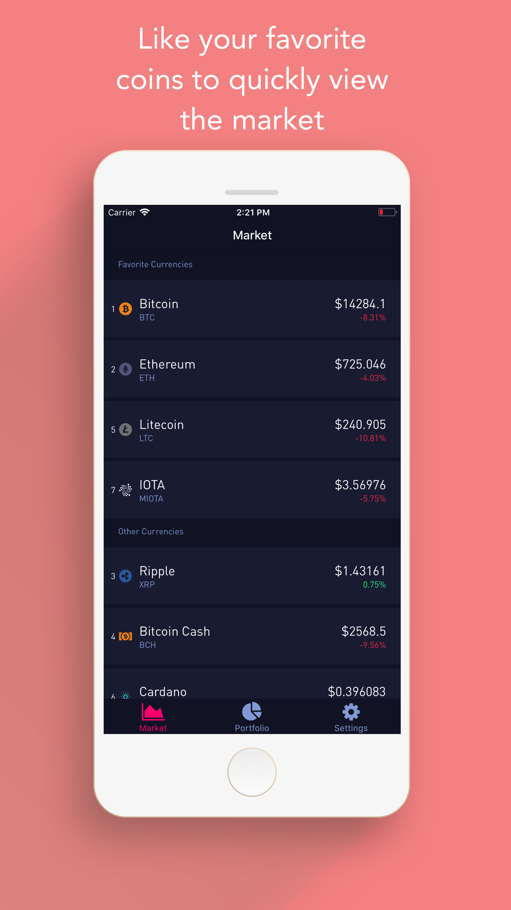
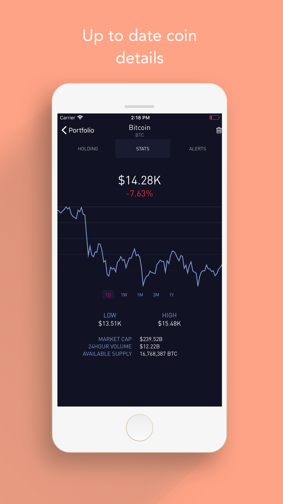
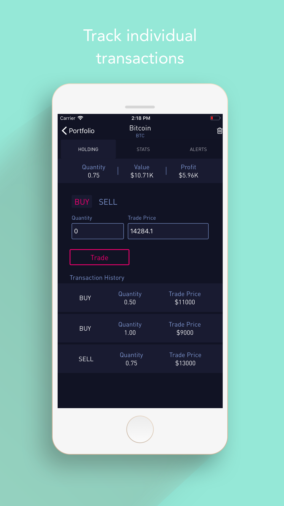
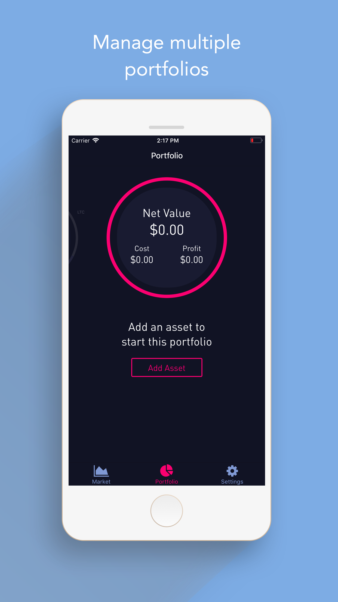

# Blockstock
A different UI/UX take on a cryptocurrency portfolio tracker built with Expo and the [cryptocompare API](https://www.cryptocompare.com/)

<!--  -->

### Features
Blockstock allows users to:
 - Manager multiple portfolios
 - Track individual trades
 - Monitor the market
 - View portfolio value, profits, and cost

